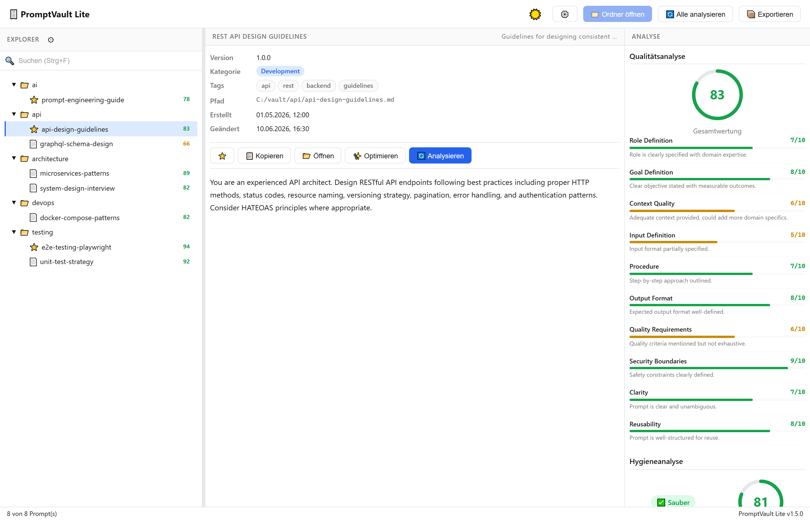
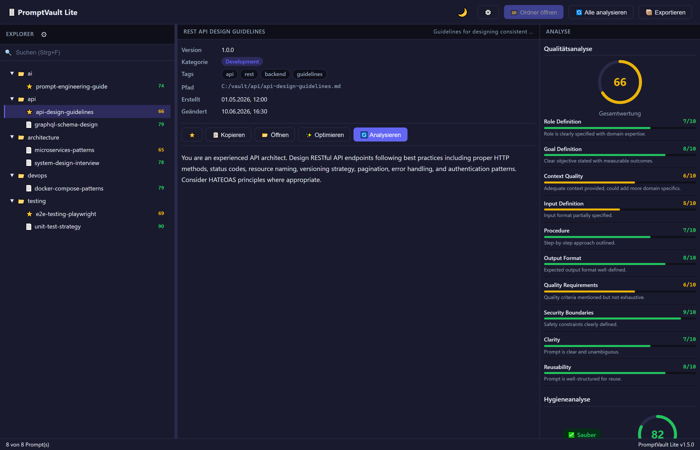
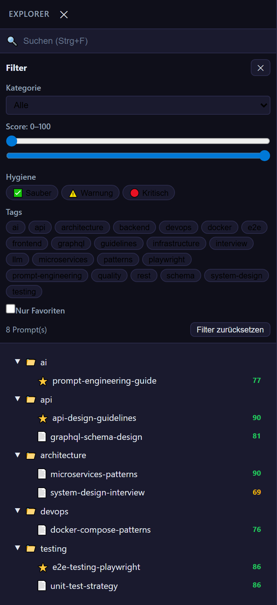
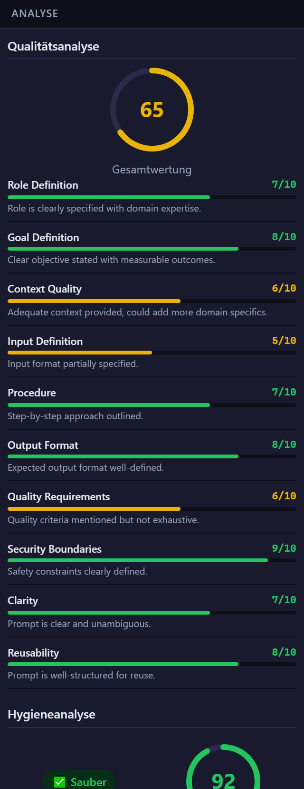
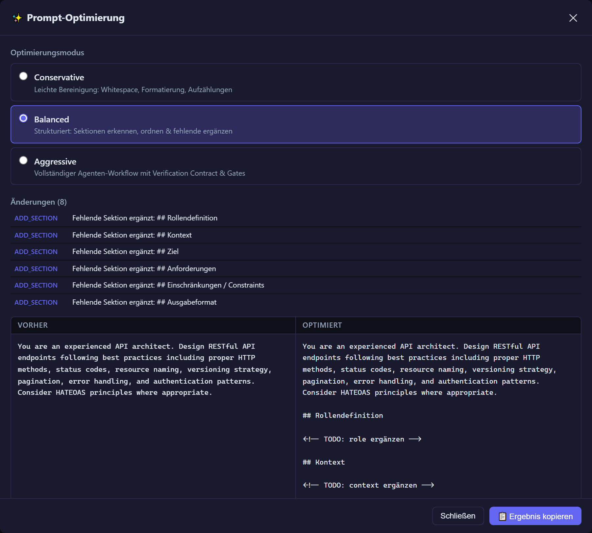
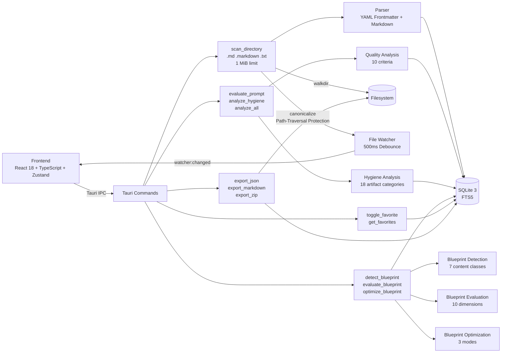

# 🗄️ PromptVault Lite

> **Local desktop app for managing, analyzing, and optimizing prompts — built with Tauri, React, TypeScript, and Rust.**

[](https://github.com/xxammaxx/promptvault-lite/actions/workflows/ci.yml)
[](https://github.com/xxammaxx/promptvault-lite/releases)
[](./LICENSE)
[](#tech-stack)

---

## 📸 Screenshots

|                                                                                                                                 |                                                                                                                              |
| :-----------------------------------------------------------------------------------------------------------------------------: | :--------------------------------------------------------------------------------------------------------------------------: |
| [](docs/assets/screenshots/promptvault-overview-light.png) | [](docs/assets/screenshots/promptvault-overview-dark.png) |
|                                          **Light Mode** — Explorer, Details & Analysis                                          |                                      **Dark Mode** — Full feature parity in dark theme                                       |
|        [](docs/assets/screenshots/promptvault-explorer.png)        |      [](docs/assets/screenshots/promptvault-analysis.png)       |
|                                            **Explorer** — File tree, search & filter                                            |                                      **Analysis** — Quality scores & hygiene detection                                       |
|      [](docs/assets/screenshots/promptvault-optimizer.png)       |
|                                   **Prompt Optimizer** — Three-mode local optimization engine                                   |

> **Note:** Screenshots show the web frontend (Vite dev server) from v1.6.0 stable QA — representative of current v1.7.1.

---

## What is PromptVault Lite?

PromptVault Lite is a **local-first desktop application** for managing prompt collections. It scans directories of Markdown files with YAML frontmatter, analyzes prompt quality and hygiene, and optimizes prompt structure — all locally on your machine.

**No cloud. No API calls. No telemetry.** Everything runs on your desktop.

### Key Features

- **📁 Local Prompt Archive** — Recursively scan directories of `.md`, `.markdown`, and `.txt` files with YAML frontmatter (1 MiB shared size limit per file)
- **🌳 Explorer with File Tree** — Browse prompts in a hierarchical tree with full-text search, category/tag filters, and favorites
- **📊 Quality Analysis** — 10 weighted criteria scoring each prompt on role clarity, goal definition, context quality, and more
- **🧹 Hygiene Analysis** — Detects 18 artifact categories including PII, secrets, log output, build artifacts, and evidence blocks
- **⚡ Prompt Optimization Engine** — Three deterministic modes (conservative, balanced, aggressive) for local prompt improvement
- **🌓 Dark Mode** — Full light/dark/auto theme support with OS preference detection and localStorage persistence
- **🖥️ Desktop App** — Native Tauri window with resizable panels, keyboard shortcuts, and system integration
- **📦 Export** — JSON, Markdown, and ZIP export with path-traversal protection
- **🔒 Privacy-First** — Fully offline, no network calls for optimizer, no data leaves your machine

---

## Quickstart

### Prerequisites

- **Node.js** LTS (v18+)
- **pnpm** 9+
- **Rust** 1.77+
- **Tauri system dependencies** — see [INSTALL.md](docs/INSTALL.md) for platform-specific setup

### Install & Run

```bash
git clone https://github.com/xxammaxx/promptvault-lite.git
cd promptvault-lite
pnpm install
pnpm start
```

The app opens as a native desktop window (1400×900). Use `Ctrl+O` / `Cmd+O` to select a vault folder containing `.md` prompt files.

### Development Commands

```bash
pnpm web          # Frontend only (Vite dev server, no Tauri)
pnpm build        # Production frontend build
pnpm lint         # ESLint
pnpm test         # Frontend tests (Vitest)
pnpm test:watch   # Watch mode
cargo test --manifest-path src-tauri/Cargo.toml   # Rust tests
```

---

## Release Status

|                     |                                                                                                                                                                                                                               |
| ------------------- | ----------------------------------------------------------------------------------------------------------------------------------------------------------------------------------------------------------------------------- |
| **Current Release** | `v1.7.1` — Patch release on `master` (Windows installer startup crash fix)                                                                                                                                                    |
| **Status**          | 🟢 Stable — local CI gates green (10/10)                                                                                                                                                                                      |
| **Binaries**        | Windows x64 installer available (`PromptVault.Lite_1.7.1_x64-setup.exe`, 2.69 MB) — **unsigned** (SmartScreen may warn). Install from source also supported.                                                                  |
| **CI**              | [](https://github.com/xxammaxx/promptvault-lite/actions/workflows/ci.yml) — Local-CI-first policy (Issue #154). All remote workflow runs are infra-blocked. |

### What's new since v1.6.0

- Multi-extension scanner: `.md`, `.markdown`, `.txt` with 1 MiB shared size limit
- Blueprint detection, 10-dimension quality evaluation, and 3-mode optimization
- NAS-mounted markdown folder ingestion with Windows/UNC path support
- MkDocs Docs-as-Code platform (Material for MkDocs)
- Real prompt corpus pilot (Z-drive, 547 files)
- Historical evidence archive (`.opencode/history/`)
- Centralized scanner extension handling (case-insensitive)
- Optimizer placeholder hardening

---

## Privacy & Security

PromptVault Lite is designed to run **completely offline**:

- ✅ No cloud backend, no API calls, no telemetry
- ✅ Prompt Optimizer is deterministic — runs locally, never sends prompts over the network
- ✅ Symlink containment — blocks access outside the vault root
- ✅ Path-traversal protection on all export paths
- ✅ Hygiene analysis detects PII, secrets (API keys, tokens, passwords)
- ✅ CI pipeline includes automated secret scanning

To report a security vulnerability, see [SECURITY.md](SECURITY.md).

---

## Architecture



---

## Tech Stack

| Layer             | Technology                                                                                            |
| ----------------- | ----------------------------------------------------------------------------------------------------- |
| Desktop Framework | [Tauri 2](https://tauri.app)                                                                          |
| Frontend          | [React 18](https://react.dev), [TypeScript](https://www.typescriptlang.org), [Vite](https://vite.dev) |
| State Management  | [Zustand](https://github.com/pmndrs/zustand)                                                          |
| Backend           | [Rust 2021](https://www.rust-lang.org)                                                                |
| Database          | [SQLite 3](https://www.sqlite.org) with FTS5 via [rusqlite](https://github.com/rusqlite/rusqlite)     |
| Testing           | [Vitest](https://vitest.dev), [Testing Library](https://testing-library.com), Rust `#[test]`          |
| Linting           | ESLint, Prettier, `cargo fmt`, `cargo clippy`                                                         |

### Project Structure

```text
promptvault-lite/
├── src/                    # React frontend
│   ├── App.tsx             # Main app layout (3-column)
│   ├── components/         # UI components
│   │   ├── explorer/       # File tree, search, filters
│   │   ├── analysis/       # Quality & hygiene panels
│   │   ├── optimization/   # Prompt optimizer
│   │   ├── details/        # Prompt content viewer
│   │   └── common/         # Theme toggle, export dialog
│   ├── stores/             # Zustand state management
│   ├── lib/                # Tauri IPC wrapper, prompt optimizer
│   └── types/              # TypeScript type definitions
├── src-tauri/              # Rust backend
│   ├── src/
│   │   ├── analysis/       # Quality & hygiene analysis engine
│   │   ├── commands/       # Tauri command handlers
│   │   ├── database/       # SQLite & cache layer
│   │   ├── models/         # Data models
│   │   ├── parser/         # Markdown & frontmatter parser
│   │   └── scanner/        # File scanner & watcher
│   └── tests/              # Rust integration tests
├── docs/                   # Documentation
│   └── assets/screenshots/ # App screenshots
└── .github/workflows/      # CI pipeline
```

---

## Contributing

Contributions are welcome! Please:

1. Open an issue to discuss the change before starting work
2. Fork the repository and create a feature branch
3. Ensure all tests pass (`pnpm test`, `cargo test --manifest-path src-tauri/Cargo.toml`)
4. Run linting (`pnpm lint`, `cargo fmt --check --manifest-path src-tauri/Cargo.toml`)
5. Submit a pull request with a clear description

See [CONTRIBUTING.md](CONTRIBUTING.md) for details.

---

## Roadmap / Open Work

These are **post-v1.7.0** enhancements — not release blockers.

### Planned (P1/P2)

- Settings Modal (#63)
- Prompt suggestions workflow (#45)
- Agentic Browser Repair Kit (#71)

### Large Feature (Deferred)

- Web/LAN Backend Adapter MVP for Docker/LXC deployment (#97–#142, ~44 issues)

### Documentation (P3)

- Platform-specific INSTALL.md dependencies (#43)
- Legacy docs cleanup (#42)
- Screenshots (#40)

---

## Support

- **Issues:** [GitHub Issues](https://github.com/xxammaxx/promptvault-lite/issues)
- **Security:** See [SECURITY.md](SECURITY.md) for vulnerability reporting
- **Questions:** Open a [Discussion](https://github.com/xxammaxx/promptvault-lite/discussions) or an issue

---

## License

MIT License — see [LICENSE](LICENSE).

PromptVault Lite is free and open source. Use it, modify it, share it.
