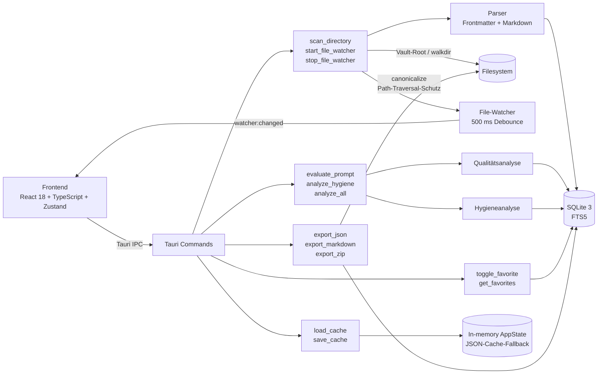

# 🗄️ PromptVault Lite

> Lokales Prompt-Management-System mit Qualitäts- und Hygieneanalyse

[](https://github.com/xxammaxx/promptvault-lite)
[](./LICENSE)
[](#-credits--stack)
[](#-testing)
[](#-fehlende-informationen)

## 📸 Screenshots

Platzhalter für UI-Aufnahmen. Sinnvolle Motive:

- Explorer mit Verzeichnisbaum, Suche und Filter-Panel
- Details-Ansicht mit Prompt-Inhalt und Metadaten
- Analyse-Ansicht mit Qualitäts- und Hygieneergebnissen

TODO: ergänzen

## ✨ Features

### Erfassung & Parsing

- **1. Rekursiver Verzeichnis-Scan** für `.md`-Dateien über `walkdir`, inklusive maximaler Tiefe von 50 Ebenen.
- **2. YAML-Frontmatter-Parsing** mit sicheren Fallbacks, damit auch unvollständige Dateien lesbar bleiben.
- **3. Markdown-Strukturanalyse** für Überschriften und Code-Blöcke.
- **4. File-Watcher** mit 500-ms-Debounce; Änderungen werden als `watcher:changed`-Event an die UI gemeldet.
- **5. Symlink-Containment**: Externe Symlinks außerhalb des Vault-Roots werden blockiert.

### Analyse

- **6. Qualitätsanalyse** mit 10 gewichteten Kriterien: Rollendefinition, Zieldefinition, Kontextqualität, Eingabendefinition, Vorgehensbeschreibung, Ausgabeformat, Qualitätsanforderungen, Sicherheitsgrenzen, Klarheit und Wiederverwendbarkeit.
- **7. Hygieneanalyse** mit 12 Artefakt-Kategorien und Score-/Status-Modell; erkennt u. a. PII, Secrets, Log-Ausgaben und Build-Artefakte.

### Organisation & Bedienung

- **8. Favoriten-System** mit SQLite-Persistenz (`toggle_favorite`, `get_favorites`).
- **9. 3-Spalten-UI** für Explorer, Details und Analyse.
- **10. Volltext-Suche** im Explorer über Titel, Kategorie, Tags und Inhalt.
- **11. Filter-Panel** mit Suchfeld, Kategorie, Score-Range, Hygiene-Status, Tags und Favoriten-Toggle.
- **12. Tastatur-Shortcuts** für Öffnen, Suchen, Analysieren, Exportieren und Zurücksetzen.
- **13. ARIA-Attribute** für Screenreader-Zugänglichkeit.
- **14. Optimistic UI** beim Favoriten-Toggle mit Rücknahme bei Fehlern.
- **15. Dynamische Versionsanzeige** in der Statusleiste über `__APP_VERSION__`.

### Export & Betrieb

- **16. Export in 3 Formaten**: JSON, Markdown und ZIP, jeweils mit Schutz gegen Path-Traversal.

### Analyse-Details

#### Qualitätsanalyse (10 Kriterien)

Gewichtung in Klammern:

- Rollendefinition (12%)
- Zieldefinition (14%)
- Kontextqualität (11%)
- Eingabendefinition (10%)
- Vorgehensbeschreibung (12%)
- Ausgabeformat (10%)
- Qualitätsanforderungen (8%)
- Sicherheitsgrenzen (8%)
- Klarheit (8%)
- Wiederverwendbarkeit (9%)

#### Hygieneanalyse

Artefakt-Kategorien:

- `PROJECT_ARTIFACT`
- `REPO_REFERENCE`
- `FILE_PATH`
- `ISSUE_REFERENCE`
- `TEST_REPORT`
- `LOG_LINE`
- `STACKTRACE`
- `BUILD_OUTPUT`
- `JSON_DUMP`
- `CODE_DUMP`
- `PII`
- `SECRET`

Score-Regel: `100 − (critical·20 + warning·8 + info·3)`

Status-Schwellen:

- `clean` ab 80
- `warning` von 50 bis 79
- `critical` unter 50

Secret-Erkennung: API-Keys, Tokens, Passwörter, Private Keys, AWS, JWT, Stripe und GitHub.

## 🏗️ Architektur



## 📦 Installation

### Systemvoraussetzungen

- Node.js LTS
- pnpm
- Rust 1.77 oder neuer
- Plattformabhängige Tauri-/WebView-/Build-Abhängigkeiten
- Linux: native Abhängigkeiten für WebKitGTK, insbesondere `libwebkit2gtk`

### Schnellstart

```bash
git clone https://github.com/xxammaxx/promptvault-lite.git
cd promptvault-lite
pnpm install
pnpm start
```

### Detaillierte Installation

#### Linux

- Installiere die für Tauri benötigten Systempakete, einschließlich WebKitGTK (`libwebkit2gtk`) und der üblichen Build-Tools.
- Danach `pnpm install` und `pnpm start` ausführen.

#### Windows

- Installiere die für Tauri erforderlichen nativen Build-/WebView-Komponenten.
- Danach `pnpm install` und `pnpm start` ausführen.

#### macOS

- Installiere die für Tauri erforderlichen nativen Build-/WebView-Komponenten.
- Danach `pnpm install` und `pnpm start` ausführen.

## 🚀 Nutzung

1. Vault-Ordner öffnen (`Strg/Cmd+O`).
2. Prompt-Dateien werden rekursiv gescannt und bei Änderungen automatisch nachgeladen.
3. Im Explorer nach Titel, Kategorie, Tags oder Inhalt suchen.
4. Über das Filter-Panel nach Score, Hygiene-Status, Favoriten und Tags eingrenzen.
5. Einzelne Prompts in der Details-Ansicht prüfen.
6. Prompt oder gesamte Sammlung analysieren.
7. Ergebnisse bei Bedarf als JSON, Markdown oder ZIP exportieren.

Beispiel für einen Prompt mit Frontmatter:

```markdown
---
title: Beispiel-Prompt
category: Support
tags:
  - api
  - docs
---

Formuliere eine präzise Antwort mit klaren Schritten.
```

## ⚙️ Konfiguration

| Bereich         | Schlüssel                                                 | Wert / Verhalten                                                   |
| --------------- | --------------------------------------------------------- | ------------------------------------------------------------------ |
| ENV             | `TAURI_PLATFORM`                                          | Wenn `windows`, wird das Build-Ziel `chrome105`; sonst `safari13`. |
| ENV             | `TAURI_DEBUG`                                             | Aktiviert Source-Maps und deaktiviert Minify.                      |
| Vite            | Port                                                      | `1420` (strict).                                                   |
| Vite            | Alias                                                     | `@` → `./src`.                                                     |
| Vite            | `__APP_VERSION__`                                         | Wird aus `package.json` injiziert.                                 |
| Vite            | `envPrefix`                                               | `VITE_`, `TAURI_`.                                                 |
| Tauri           | `devUrl`                                                  | `http://localhost:1420`.                                           |
| Tauri           | `frontendDist`                                            | `../dist`.                                                         |
| Tauri           | `beforeDevCommand`                                        | `pnpm dev`.                                                        |
| Tauri           | `beforeBuildCommand`                                      | `pnpm build`.                                                      |
| Tauri           | Identifier                                                | `dev.promptvault.lite`.                                            |
| Tauri           | Fenstergröße                                              | 1400×900, Minimum 1024×600.                                        |
| Filter-Defaults | Suchfeld / Kategorie / Score / Hygiene / Tags / Favoriten | TODO: im Quellstand nicht explizit dokumentiert.                   |

Hinweis: Es gibt keine `.env`- oder `.env.example`-Datei; die App ist selbst enthalten.

## 🔧 Entwicklung

### Dev-Setup

```bash
git clone https://github.com/xxammaxx/promptvault-lite.git
cd promptvault-lite
pnpm install
pnpm start
```

Weitere nützliche Befehle:

```bash
pnpm web          # Nur Frontend (ohne Tauri)
pnpm dev          # Alias für web
pnpm build        # Frontend-Produktions-Build
pnpm lint         # ESLint-Prüfung
pnpm format       # Prettier-Formatierung
pnpm test         # Tests ausführen
cargo test --manifest-path src-tauri/Cargo.toml
```

### Projektstruktur

```text
PromptVault_Lite/
├── README.md
├── package.json
├── pnpm-lock.yaml
├── pnpm-workspace.yaml
├── vite.config.ts
├── src/
│   ├── App.tsx
│   ├── App.css
│   ├── lib/tauri.ts
│   ├── stores/appStore.ts
│   ├── hooks/
│   └── components/
├── src-tauri/
│   ├── Cargo.toml
│   ├── tauri.conf.json
│   ├── src/
│   │   ├── analysis/
│   │   ├── commands/
│   │   ├── database/
│   │   ├── models/
│   │   ├── parser/
│   │   └── scanner/
│   └── tests/command_errors.rs
├── docs/
│   ├── INSTALL.md
│   ├── USER_GUIDE.md
│   ├── ARCHITECTURE.md
│   ├── TESTING.md
│   └── CHANGELOG.md
└── public/
```

### Coding Standards

- Frontend: ESLint 8.57 mit `@typescript-eslint/strict-type-checked` und `react-hooks/recommended`.
- Formatierung: Prettier 3.3.
- Tests: Vitest 1.6.0 und Testing Library.
- Rust: `cargo test` ist verifiziert; `cargo fmt` und `cargo clippy` sind im Kontext nicht als Script bestätigt.
- Pre-commit-Hook: TODO: prüfen.

## 🧪 Testing

### Verfügbare Test-Befehle

```bash
pnpm test
pnpm test:watch
cargo test --manifest-path src-tauri/Cargo.toml
```

### Aktueller Stand

- Frontend: 5 Test-Dateien, 94 Tests, 100 % bestanden.
- Rust: 96 Lib-Tests (1 ignoriert) plus 17 Integrationstests.
- Coverage: nicht konfiguriert.
- CI: nicht konfiguriert.

## 📝 API / Tauri Commands

| Command              | Modul                     | Parameter                                       | Rückgabe                           | Hinweise / Fehler                                               |
| -------------------- | ------------------------- | ----------------------------------------------- | ---------------------------------- | --------------------------------------------------------------- |
| `scan_directory`     | `commands/scan.rs`        | `path: String`                                  | `Result<Vec<PromptItem>, String>`  | Startet nach Erfolg automatisch den Watcher.                    |
| `start_file_watcher` | `commands/scan.rs`        | `path: String`                                  | `Result<(), String>`               | Ersetzt einen aktiven Watcher.                                  |
| `stop_file_watcher`  | `commands/scan.rs`        | –                                               | `Result<(), String>`               | Idempotent.                                                     |
| `evaluate_prompt`    | `commands/analyze.rs`     | `prompt_id: String, content: String`            | `Result<PromptEvaluation, String>` | Inhaltsbasiert; soll immer auswertbar sein.                     |
| `analyze_hygiene`    | `commands/analyze.rs`     | `prompt_id: String, content: String`            | `Result<PromptHygiene, String>`    | Inhaltsbasiert; soll immer auswertbar sein.                     |
| `analyze_all`        | `commands/analyze.rs`     | `prompts: Vec<PromptItem>`                      | `Result<AnalysisReport, String>`   | Enthält Evaluations, Hygiene, `total_prompts`, `average_score`. |
| `toggle_favorite`    | `commands/favorites.rs`   | `prompt_id: String`                             | `Result<bool, String>`             | Liefert den neuen Zustand; Fehler bei unbekannter ID.           |
| `get_favorites`      | `commands/favorites.rs`   | –                                               | `Result<Vec<String>, String>`      | Gibt Favoriten-IDs zurück.                                      |
| `export_json`        | `commands/export.rs`      | `prompt_ids, export_path, evaluations, hygiene` | `Result<String, String>`           | Gibt den Dateipfad zurück.                                      |
| `export_markdown`    | `commands/export.rs`      | `prompt_ids, export_path, evaluations, hygiene` | `Result<String, String>`           | Gibt den Dateipfad zurück.                                      |
| `export_zip`         | `commands/export.rs`      | `prompt_ids, export_path, evaluations, hygiene` | `Result<String, String>`           | Gibt den ZIP-Pfad zurück.                                       |
| `load_cache`         | `commands/persistence.rs` | –                                               | `Result<Vec<PromptItem>, String>`  | Liest aus dem in-memory `AppState`.                             |
| `save_cache`         | `commands/persistence.rs` | `prompts: Vec<PromptItem>`                      | `Result<(), String>`               | Schreibt in den in-memory `AppState`.                           |

### Exportformate

- **JSON**: `promptvault-export.json` mit `export_date`, `version` und allen Prompts samt Scores.
- **Markdown**: `promptvault-export.md` mit YAML-Frontmatter; Scores werden zusätzlich als `#`-Kommentare abgelegt.
- **ZIP**: `promptvault-export.zip` mit rekonstruierten `.md`-Dateien sowie `metadata.json` und `index.json`.
- Fortschritt: `export:progress` mit `{current, total, format}`.

## 🏭 Deployment / Build

```bash
pnpm build
pnpm tauri build
```

Hinweise:

- `pnpm build` erzeugt den Frontend-Produktions-Build.
- `pnpm tauri build` erzeugt das plattformspezifische App-Bundle.
- `frontendDist` ist auf `../dist` gesetzt; die konkrete Bundle-Ausgabe hängt von der Zielplattform ab.
- TODO: genaue Output-Pfade im Build-Output dokumentieren.

## 🤝 Contributing

- Kleinere, klar abgegrenzte Issues bevorzugen.
- Änderungen sollten mit Tests begleitet werden.
- README und `docs/ARCHITECTURE.md` gemeinsam prüfen, wenn Architektur oder Schnittstellen betroffen sind.
- Pull Requests sollten reproduzierbare Schritte, Tests und mögliche Risiken enthalten.
- Offene Issue-Beschreibung und aktuelle Dokumentation vor Implementierung lesen.

## 🔒 Sicherheit & Datenschutz

- Alles läuft lokal; es gibt keine dokumentierte Cloud-Anbindung.
- Symlink-Containment verhindert den Zugriff auf Dateien außerhalb des Vault-Roots.
- Export und ZIP-Erstellung schützen gegen Path-Traversal via `canonicalize`.
- Hygieneanalyse markiert PII und Secrets sowie Log-, Stacktrace- und Build-Artefakte.
- Die App respektiert keine projektspezifischen geheimen ENV-Variablen; ein `.env`-Setup ist nicht vorgesehen.

## 📄 Lizenz

MIT License — siehe [LICENSE](./LICENSE).

Kurzform: Beliebige Nutzung, Änderung und Weitergabe erlaubt, solange der Copyright-Hinweis erhalten bleibt. Keine Gewährleistung.

## 🙏 Credits / Stack

| Bereich           | Technologie                    | Link                                                                                 |
| ----------------- | ------------------------------ | ------------------------------------------------------------------------------------ |
| Frontend          | React 18, TypeScript, Vite     | https://react.dev / https://www.typescriptlang.org / https://vite.dev                |
| State             | Zustand                        | https://github.com/pmndrs/zustand                                                    |
| Rendering         | react-markdown                 | https://github.com/remarkjs/react-markdown                                           |
| Code-Highlighting | react-syntax-highlighter       | https://github.com/react-syntax-highlighter/react-syntax-highlighter                 |
| Backend           | Rust 2021, Tauri 2, rusqlite   | https://www.rust-lang.org / https://tauri.app / https://github.com/rusqlite/rusqlite |
| Datenbank         | SQLite 3 mit FTS5              | https://www.sqlite.org/fts5.html                                                     |
| Testing           | Vitest, Testing Library, jsdom | https://vitest.dev / https://testing-library.com / https://github.com/jsdom/jsdom    |
| Linting / Format  | ESLint, Prettier               | https://eslint.org / https://prettier.io                                             |

## Fehlende Informationen

- Keine Screenshots im Repository vorhanden.
- Kein Code-of-Conduct dokumentiert.
- Filter-Defaults sind im hier vorliegenden Quellstand nicht explizit dokumentiert.
- Windows- und macOS-spezifische Native-Dependency-Liste ist im Kontext nicht vollständig ausformuliert.
- Genaue Build-Output-Pfade sind im Kontext nicht vollständig dokumentiert.
