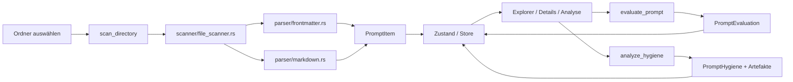

# Architektur

## Architekturdiagramm

```text
┌──────────────┐      ┌──────────────────────┐      ┌────────────────────────┐
│ Benutzer     │──────▶│ React / TypeScript   │──────▶│ Tauri Commands (Rust)  │
└──────────────┘      │  - Explorer          │      │  - scan                │
                      │  - Details           │      │  - analyze             │
                      │  - Analysis          │      │  - persistence         │
                      └──────────┬───────────┘      └──────────┬─────────────┘
                                 │                             │
                                 ▼                             ▼
                      ┌──────────────────────┐      ┌────────────────────────┐
                      │ Zustand Store        │      │ Rust Services          │
                      │ UI-State / Filter     │      │ scanner / parser /     │
                      └──────────────────────┘      │ analysis / database    │
                                                     └──────────┬─────────────┘
                                                                │
                                                                ▼
                                                     ┌────────────────────────┐
                                                     │ Dateisystem / Cache /  │
                                                     │ SQLite                 │
                                                     └────────────────────────┘
```

## Datenfluss



## Module

### Scanner

- `src-tauri/src/scanner/file_scanner.rs`
- Rekursiver Scan von Markdown-Dateien
- Ignoriert Nicht-`md`-Dateien
- Löst Symlinks auf und begrenzt die Tiefe

### Parser

- `src-tauri/src/parser/frontmatter.rs`
- `src-tauri/src/parser/markdown.rs`
- Extrahiert YAML-Frontmatter, Content, Überschriften und Codeblöcke

### Analysis

- `src-tauri/src/analysis/quality.rs`
- `src-tauri/src/analysis/hygiene.rs`
- `src-tauri/src/analysis/artifacts.rs`
- `src-tauri/src/analysis/recommendations.rs`
- Liefert Score, Status, Artefakte und Empfehlungen

### Database

- `src-tauri/src/database/sqlite.rs`
- `src-tauri/src/database/cache.rs`
- SQLite ist als primäre Persistenz implementiert; JSON ist der Fallback

### Commands

- `src-tauri/src/commands/scan.rs`
- `src-tauri/src/commands/analyze.rs`
- `src-tauri/src/commands/favorites.rs`
- `src-tauri/src/commands/export.rs`
- `src-tauri/src/commands/persistence.rs`
- Stellt die Tauri-API für das Frontend bereit

### Frontend-Komponenten

- `src/App.tsx`
- `src/components/explorer/*`
- `src/components/details/DetailsPanel.tsx`
- `src/components/analysis/AnalysisPanel.tsx`
- `src/stores/appStore.ts`
- `src/lib/tauri.ts`

## Technologieentscheidungen

- **Tauri 2**: schlanke Desktop-Hülle mit Rust-Backend
- **React + TypeScript + Vite**: schnelle UI-Entwicklung
- **Rust**: sichere Datei- und Analyse-Logik
- **SQLite**: lokaler, indexierbarer Speicher für größere Sammlungen
- **JSON-Cache**: portable Fallback-Option
- **Regex/Heuristiken**: deterministische lokale Analyse

## Dateistruktur (Auszug)

```text
PromptVault_Lite/
├── src/
│   ├── App.tsx
│   ├── App.css
│   ├── lib/tauri.ts
│   ├── stores/appStore.ts
│   ├── types/index.ts
│   └── components/
│       ├── explorer/
│       ├── details/
│       └── analysis/
├── src-tauri/
│   ├── Cargo.toml
│   └── src/
│       ├── analysis/
│       ├── commands/
│       ├── database/
│       ├── models/
│       ├── parser/
│       └── scanner/
└── docs/
    ├── README.md
    ├── INSTALL.md
    ├── ARCHITECTURE.md
    ├── USER_GUIDE.md
    ├── TESTING.md
    └── CHANGELOG.md
```
