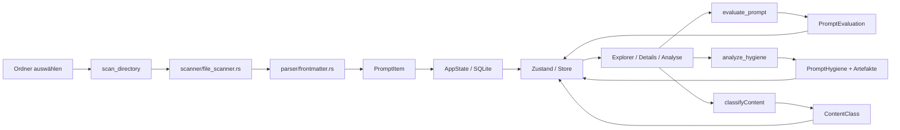

# Architektur

## Architekturdiagramm

```text
┌──────────────┐      ┌─────────────────────────────┐      ┌──────────────────────────┐
│ Benutzer     │──────▶│ React / TypeScript / Vite   │──────▶│ Tauri Commands (Rust)    │
└──────────────┘      │  - Explorer / FileTree       │      │  - scan / watch          │
                      │  - Details / Analysis        │      │  - analyze / hygiene     │
                      │  - Paste Prompt Analyzer     │      │  - export (JSON/MD/ZIP)  │
                      │  - Audio Summary             │      │  - favorites / persist   │
                      │  - Settings                  │      │  - actions               │
                      │  - Optimization Panels       │      └──────────┬───────────────┘
                      └──────────┬──────────────────┘                │
                                 │                                    ▼
                                 ▼                         ┌──────────────────────────┐
                      ┌─────────────────────────┐         │ Rust Backend Services     │
                      │ Zustand Store            │         │ scanner / parser /        │
                      │ UI-State / Filter /      │         │ analysis / database /     │
                      │ Settings                 │         │ watcher / actions         │
                      └─────────────────────────┘         └──────────┬───────────────┘
                                                                     │
                                                                     ▼
                                                          ┌──────────────────────────┐
                                                          │ Dateisystem / SQLite /   │
                                                          │ JSON-Cache / In-Memory   │
                                                          └──────────────────────────┘
```

## Datenfluss



## Module

### Scanner

- `src-tauri/src/scanner/file_scanner.rs`
- `src-tauri/src/scanner/watcher.rs`
- Rekursiver Scan von Prompt-Textdateien
- Unterstützt `.md`, `.markdown`, `.txt` (case-insensitive)
- 1 MiB Dateigrößenlimit (1.048.576 Bytes)
- Löst Symlinks auf und begrenzt die Tiefe und Symlink-Tiefe
- Null-Byte-Rejection, Path-Traversal-Schutz
- Maximale Rekursionstiefe: 50
- File Watcher mit 500ms Debounce für automatisches Re-Scanning

### Parser

- `src-tauri/src/parser/frontmatter.rs`
- `src-tauri/src/parser/markdown.rs`
- Extrahiert YAML-Frontmatter, Titel, Tags
- Markdown-Strukturparser ist vorhanden, derzeit nicht im produktiven Scan-Pfad

### Analysis (Backend)

- `src-tauri/src/analysis/quality.rs`
- `src-tauri/src/analysis/hygiene.rs`
- `src-tauri/src/analysis/artifacts.rs`
- `src-tauri/src/analysis/recommendations.rs`
- Qualitätsanalyse: 10 gewichtete Kriterien, Score 0-100
- Hygieneanalyse: 18 Artefakt-Kategorien, Score 0-100
- Liefert Score, Status, Artefakte und Empfehlungen

### Analysis (Frontend)

- `src/lib/promptOptimizer.ts` — Prompt-Optimierung (3 Modi)
- `src/lib/blueprintDetection.ts` — Blueprint-Erkennung (7 Content-Klassen)
- `src/lib/blueprintOptimizer.ts` — Blueprint-Optimierung (3 Modi)
- `src/lib/promptContextEvaluation.ts` — TypeScript Context Evaluation
- `src/lib/pastePromptAnalysis.ts` — Direktanalyse ohne Datei

### Paste Prompt Analyzer

- `src/components/paste/PastePromptAnalyzer.tsx`
- `src/lib/pastePromptAnalysis.ts`
- Clipboard- und Direkttext-Analyse ohne Datei, ohne Speicherung
- Separate UI-Komponente „Direktanalyse"
- Lokale Analysepipeline (Qualität, Hygiene, Blueprint, Optimierung)
- Keine Persistenz, keine Cloud/API

### Audio Summary

- `src/components/details/PromptAudioSummary.tsx`
- `src/lib/promptAudioSummary.ts` — KI-lesbare Textzusammenfassung
- `src/lib/localTts.ts` — lokale TTS via Web Speech API
- Zeigt Textzusammenfassung immer an, optionale Audioausgabe
- Blockiert Audioausgabe bei PII/Secret-Inhalten

### Embeddings (Phase 1)

- `src/lib/embeddings/`
- `MockEmbeddingProvider` — deterministisch, synthetisch, kein Netzwerk/Datei-I/O
- `EmbeddingProvider` Interface — provider-agnostischer Contract
- Feature Flag `PROMPTVAULT_EMBEDDINGS=1` (standardmäßig deaktiviert)
- `createEmbeddingProvider()` Factory mit Feature-Flag-Gating
- Phase 1 ist mock-only — keine echte semantische Suche, kein ML-Modell
- Keine neuen Dependencies (kein ONNX, kein Ollama, kein sqlite-vec)

### Settings

- `src/components/settings/SettingsPanel.tsx`
- Theme (Light/Dark/Auto), Export-Format, Developer Mode, Reset
- Persistenz via localStorage

### Database / Persistenz

- `src-tauri/src/database/sqlite.rs`
- `src-tauri/src/database/cache.rs`
- SQLite ist initialisiert und wird u.a. für Favorites verwendet
- AppState hält Prompts primär in-memory während der Session
- JsonCache existiert als Modul; Persistence-Commands arbeiten derzeit in-memory
- SQLite ist nicht als durchgängige primäre Source of Truth für gescannte Prompts verdrahtet

### Export

- `src-tauri/src/commands/export.rs`
- Formate: JSON, Markdown, ZIP
- CSV ist NICHT als Backend-Export implementiert
- ZIP enthält rekonstruierte Markdown-Dateien, `metadata.json`, `index.json`
- `export:progress` Events für Fortschrittsanzeige
- Zielpfad-Validierung via canonicalize (Path-Traversal-Schutz)

### Commands

- `src-tauri/src/commands/scan.rs`
- `src-tauri/src/commands/analyze.rs`
- `src-tauri/src/commands/favorites.rs`
- `src-tauri/src/commands/export.rs`
- `src-tauri/src/commands/persistence.rs`
- `src-tauri/src/commands/actions.rs`
- Stellt die Tauri-API für das Frontend bereit

### Typed Local Action Layer

- `src/actions/contracts.ts` — Action Contracts
- `src/actions/registry.ts` — Action Registry
- `src/actions/handlers.ts` — Action Handler
- `src/actions/evidence.ts` — Evidence Logging
- `src-tauri/src/commands/actions.rs` — Backend Action Handler
- Developer Mode Gate für Write-Actions
- Approval Provider für Schreiboperationen

### Frontend-Komponenten

- `src/App.tsx`
- `src/components/explorer/*` — FileTree, FilterPanel, SearchBar, TreeNode
- `src/components/details/DetailsPanel.tsx` — Prompt-Details
- `src/components/details/PromptAudioSummary.tsx` — Audio-Zusammenfassung
- `src/components/analysis/AnalysisPanel.tsx` — Qualität & Hygiene
- `src/components/analysis/BlueprintEvaluationPanel.tsx` — Blueprint-Analyse
- `src/components/optimization/OptimizationPanel.tsx` — Prompt-Optimierung
- `src/components/optimization/BlueprintOptimizationPanel.tsx` — Blueprint-Optimierung
- `src/components/paste/PastePromptAnalyzer.tsx` — Direktanalyse
- `src/components/settings/SettingsPanel.tsx` — Einstellungen
- `src/components/common/ExportDialog.tsx` — Export-Dialog
- `src/stores/appStore.ts` — Zustand Store
- `src/hooks/useExport.ts`
- `src/hooks/useKeyboardShortcuts.ts`
- `src/hooks/useResizablePanel.ts`
- `src/lib/tauri.ts` — Typisierte Tauri IPC API

## Technologieentscheidungen

- **Tauri 2**: schlanke Desktop-Hülle mit Rust-Backend
- **React + TypeScript + Vite**: schnelle UI-Entwicklung
- **Zustand**: State Management
- **Rust**: sichere Datei- und Analyse-Logik
- **SQLite**: lokaler, indexierbarer Speicher für bestimmte Funktionen (Favorites)
- **JSON-Cache**: vorhandenes Modul für portable Persistenz
- **Regex/Heuristiken**: deterministische lokale Analyse
- **Web Speech API**: lokale TTS für Audio Summary (keine externen Dienste)
- **Mock Embedding Provider**: Phase 1 — deterministisch, synthetisch, kein ML-Modell

## Sicherheitsgrenzen

- **Scanner:** Null-Byte-Rejection, Symlink-Containment, Symlink-Tiefenbegrenzung, max. Rekursionstiefe 50, 1 MiB Dateilimit
- **Export:** Zielverzeichnis canonicalized, ZIP-Pfade bereinigt
- **Action Layer:** Developer Mode Gate, Approval für Write-Actions, Fixture Path Sanitization
- **UI:** Blockierte Anzeige bei sensiblen Blueprint-Inhalten, Audioausgabe deaktivierbar
- **Privacy:** Keine Netzwerkaufrufe, keine Cloud/API, keine Telemetrie, Local-first

## Dateistruktur (Auszug)

```text
PromptVault_Lite/
├── src/
│   ├── App.tsx
│   ├── App.css
│   ├── lib/
│   │   ├── tauri.ts
│   │   ├── promptOptimizer.ts
│   │   ├── blueprintDetection.ts
│   │   ├── blueprintOptimizer.ts
│   │   ├── promptContextEvaluation.ts
│   │   ├── pastePromptAnalysis.ts
│   │   ├── promptAudioSummary.ts
│   │   ├── localTts.ts
│   │   └── embeddings/
│   ├── stores/appStore.ts
│   ├── types/index.ts
│   ├── actions/
│   ├── hooks/
│   └── components/
│       ├── explorer/
│       ├── details/
│       ├── analysis/
│       ├── optimization/
│       ├── paste/
│       ├── settings/
│       └── common/
├── src-tauri/
│   ├── Cargo.toml
│   └── src/
│       ├── analysis/
│       ├── commands/
│       ├── database/
│       ├── models/
│       ├── parser/
│       └── scanner/
└── docs/
    ├── README.md
    ├── ARCHITECTURE.md
    ├── ROADMAP.md
    ├── PROJECT_STATUS.md
    ├── INSTALL.md
    ├── TESTING.md
    ├── CHANGELOG.md
    ├── EVIDENCE_PORTFOLIO.md
    └── GOVERNANCE.md
```
