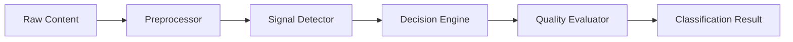

# System Design: Prompt Classification Pipeline

## Overview

Design and implement a multi-stage classification pipeline that
determines whether each prompt vault entry is a PROMPT, BLUEPRINT,
DOCUMENTATION, GUIDELINE, or CODE_FRAGMENT.

## System Components

### Stage 1: Preprocessor

- Strips frontmatter metadata
- Normalizes whitespace and encoding
- Detects content language (DE/EN)

### Stage 2: Signal Detector

- Runs regex-based signal detection against 25+ signal definitions
- Classifies each signal as prompt, blueprint, guideline, or hybrid
- Collects signal counts by category

### Stage 3: Decision Engine

- Applies rule-based classification (if-else chain)
- Assigns confidence score based on signal strength
- Generates classification reasons

### Stage 4: Blueprint Quality Evaluator

- Scores 10 quality dimensions (goal clarity, scope, architecture, etc.)
- Generates improvement suggestions for low-scoring dimensions

## Verification Contract

### Gate 1: Unit Tests

- Each signal detector is tested individually
- Each classification branch is tested with boundary cases
- Coverage minimum: 90%

### Gate 2: Integration Tests

- Full pipeline test with synthetic fixtures
- Real corpus smoke test (aggregate metrics only)
- Regression test suite covers all past issues

### Gate 3: Acceptance Criteria

- Classification accuracy >= 85% on synthetic test suite
- DOC/BLUEPRINT boundary accuracy >= 90%
- No crashes on empty, malformed, or binary input

## Data Flow

## Implementation Plan

### Step 1: Signal definitions

- Define all CLASSIFICATION_SIGNALS with name, category, detect function
- Add STRONG vs WEAK differentiation for blueprint signals

### Step 2: Decision chain

- Implement classifyContent with protection order
- Write tests for each branch

### Step 3: Quality evaluation

- Implement BLUEPRINT_CRITERIA with 10 dimensions
- Generate improvement suggestions

## Constraints

- No LLM or AI service calls
- No network requests
- Pure deterministic classification
- Performance: classify < 10ms per document

## Risks

- Regex-based detection may miss edge cases
- Language-specific patterns (DE/EN) require maintenance
- Very short content may have ambiguous signals
